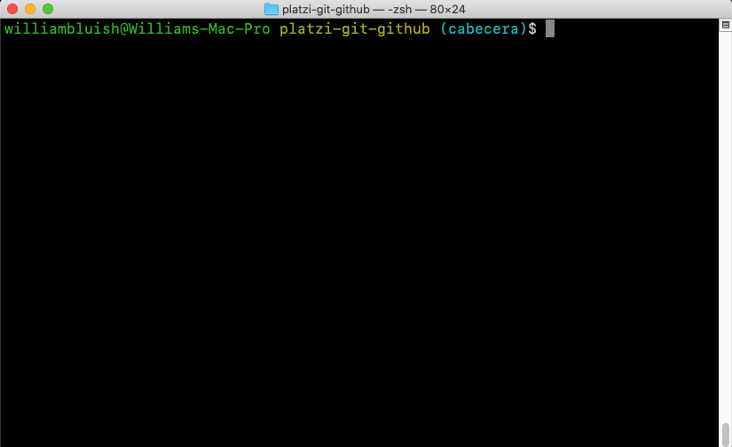

# ZSH Theme Modifier (for MacOS) &middot; [](LICENSE)
Modifica la apariencia de la terminal zsh de MacOS, le da colores y además muestra el nombre de la rama actual de git.

| [:sparkles: Getting Started](#getting-started) | [:rocket: Download](#download) |
| --------------- | -------- |

<p align="center">
  
</p>

## Getting Started
Follow the below instructions to get started:
- [Make sure you have all Requirements](#requirements)
- [Download Source Code](#download)
- Open `install.sh` in ZSH Terminal and Enjoy!

## Requirements
Make sure you have the below requirements before starting:
- Basic Knowledge about sh

## Download
You can get access to source code by using one of the following ways:
- :sparkles: Download Source Code
- :fire: Clone the repository locally:
```bash
git clone https://github.com/williambluish/MacOS-ZSHTM.git
```

## Credits
- [German Fica](https://williambluish.github.io)

## External tools
None.

## License
[MIT](https://opensource.org/licenses/MIT)
